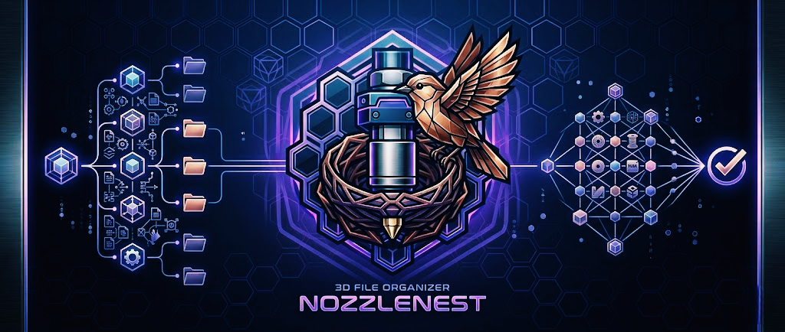

<p align="center">
  
</p>

# NozzleNest 🦅

**NozzleNest** is a premium, next-generation 3D print organizer desktop application built with Electron, React, Vite, and SQLite for Windows.

> [!WARNING]
> **Hobbyist Developer Notice:** As an independent open-source project, I do not currently pay for an expensive code-signing certificate. When you download and run the `.exe` installer, **Windows SmartScreen** may show a warning saying the publisher is unknown. This is completely normal for unsigned indie software. To install, click "More info" and then "Run anyway". You can review the fully open-source code here to verify its safety!


## Key Features

- **Dashboard:** Modern, premium dark interface with dynamic micro-animations, real-time printing stats, and an activity feed showing recently added/printed models.
- **Embedded Browser & Persistent Sessions:** Browse top model repositories (Printables, Thingiverse, Thangs, MakerWorld, MakerOnline) natively. Integrated with a persistent session partition (`persist:nozzlenest-browser`) that keeps your cookies, storage, and logins active across application restarts.
- **Google OAuth & Popup Support:** Out-of-the-box support for popup-based authentication (like Google Login or site-specific sign-in modals) by routing guest popups into dedicated secondary parent-locked windows.
- **Advanced Metadata & Tag Scraper:** HTML5 metadata extraction using structured JSON-LD data, meta properties, and targeted selectors.
  - **Details Page Backfill:** Automatically navigates to and silently scrapes primary model details pages if downloads are initiated from file list pages (perfect for dynamic SPAs), cache-saving the scraped tags and thumbnails.
  - **Printables GraphQL Integration:** Direct main-process server-to-server GraphQL query handler bypasses dynamic rendering times and CORS blocks, extracting tags and image locations instantly.
- **Bulletproof 2-Stage Thumbnail Fetching:**
  - **Stage 1 (Frontend DOM Scraper):** Parses high-res images and JSON-LD assets automatically on page interactions.
  - **Stage 2 (Backend GraphQL API Fallback):** Automatically queries Printables API backend on download confirmation if DOM selectors were missed.
  - **Native CDN Bypass:** Automatically spoof-injects browser-standard `User-Agent` and `Referer` headers to fetch images reliably from hotlink-protected CDNs (e.g. Printables CDN).
- **Model Library & Real-time Re-renders:** Easily organize, tag, group into Collections, and search your models. Built-in instant refresh listener loads new models and their downloaded cover thumbnails in real-time immediately after background download threads finish. Includes full-size image views and an on-demand Three.js 3D viewer.
- **Local SQLite DB:** 100% local database with zero-cloud accounts required.
- **Local storage structure:** Models are stored in a dedicated, structured directory (defaulting to `C:\NozzleNest` but fully customizable in settings).
- **Printing Queue:** Drag-and-drop to prioritize prints. Mark items as successfully printed or failed with optional troubleshooting notes.
- **Slicer integration:** Open files directly in your system default slicer or define a custom executable path.
- **Windows Integration:** Adds a right-click "Add to NozzleNest" context menu option for `.stl` and `.3mf` files in Windows Explorer.
- **Update notifications:** Checks the public GitHub releases API on startup and notifies you of new updates.

## Technology Stack

- **App Shell:** Electron (v30+)
- **Frontend UI:** React + Vite
- **Styling:** Custom CSS with CSS variables (sleek dark mode, glassmorphism, responsive grid/list)
- **3D Engine:** Three.js with React Three Fiber (`@react-three/fiber` & `@react-three/drei`)
- **Database:** SQLite (via `better-sqlite3`)
- **Archive Extraction:** `adm-zip`
- **Packaging:** `electron-builder`

## Getting Started

### Prerequisites

- Node.js (v18+)
- npm (v9+)
- C++ Build Tools (required for native SQLite compilation)

### Installation & Scaffolding

1. **Clone the repository:**
   ```bash
   git clone https://github.com/papakonnekt/nozzlenest.git
   cd nozzlenest
   ```

2. **Install all dependencies (compiles native database bindings):**
   ```bash
   npm install
   ```

3. **Start the hot-reloading development environment:**
   ```bash
   npm run dev
   ```

4. **Build and package the production installer executable (.exe):**
   ```bash
   npm run build
   ```

Have fun coding, and keep the nest glowing!
